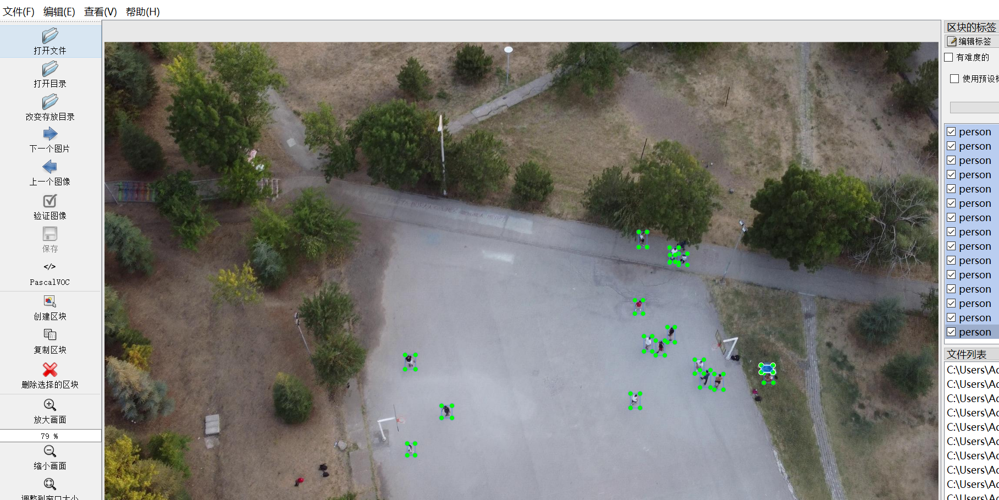
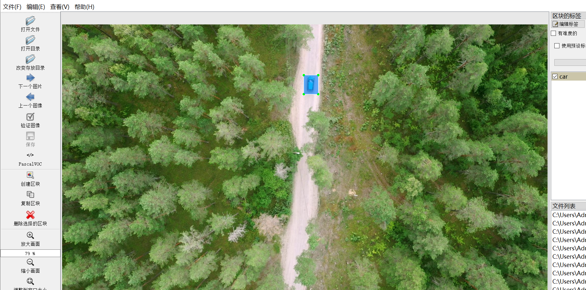
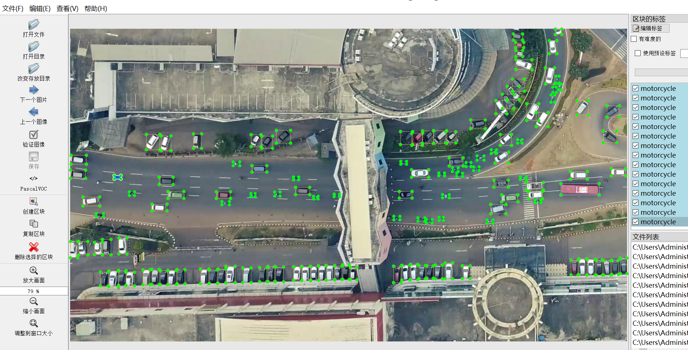
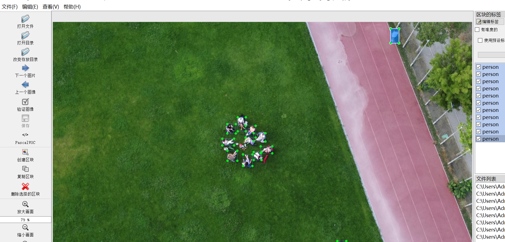
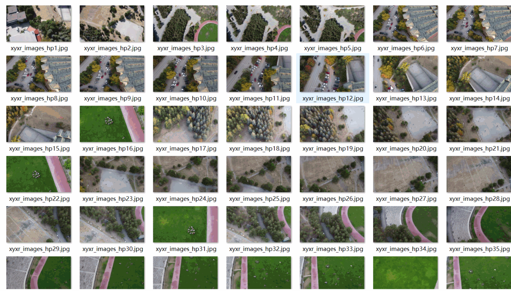
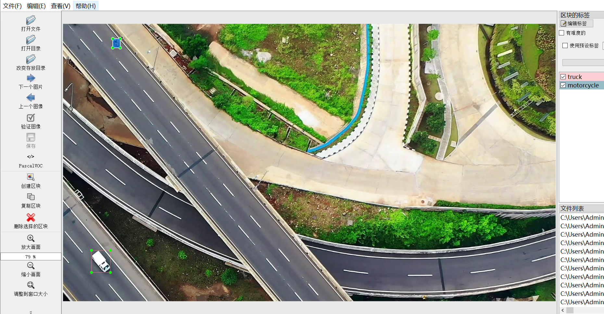

# [Object Detection] Aerial viewpoint Person Vehicle Detection Dataset 2721 imagesYOLO+VOC

Dataset Format: VOC format + YOLO format

The compressed file contains: three folders, each storing images, xml files, and text files.

Total jpg images in JPEGImages folder: 2721

The total number of xml files in the Annotations folder is 2721.

The total number of txt files in the labels folder is 2721.

Number of tag varieties: 9

Tag names: ["agricultural vehicle","boat","bus","car","construction vehicle","motorcycle","person","train","truck"]

The number of boxes for each label (Note that the order of labels in the Yolo format does not correspond to this, but is based on the classes.txt file in the labels folder):

agricultural vehicle frame count = 14

boat frame count = 16

bus frame count = 253

car frame count = 17641

construction vehicle frame count = 393

motorcycle frame count = 1795

person frame count = 12317

train frame count = 430

truck frame count = 977

Total boxes: 33836

Picture clarity (Resolution: Pixels): Clear

Is the image enhanced: No

Shape of the label: Rectangular box, used for object detection and recognition.

Important Note: None

Special Notice: This dataset does not guarantee the accuracy or precision of the trained models or weight files. The dataset only provides accurate and reasonable annotations.

Picture overview

## Images

---

Here is a pay link on Stripe (https://buy.stripe.com/3cs8yP7sY87d0vu9AB). Please contact me lonlonago@foxmail.com after funding $89, and I will send you a complete data files, thank you!

